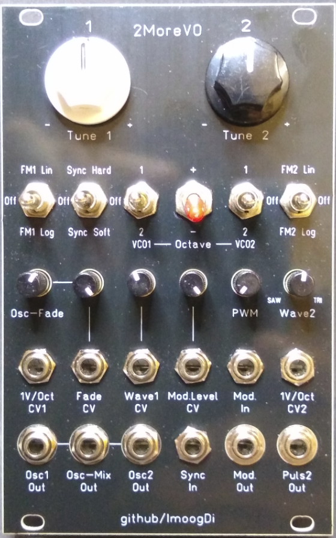
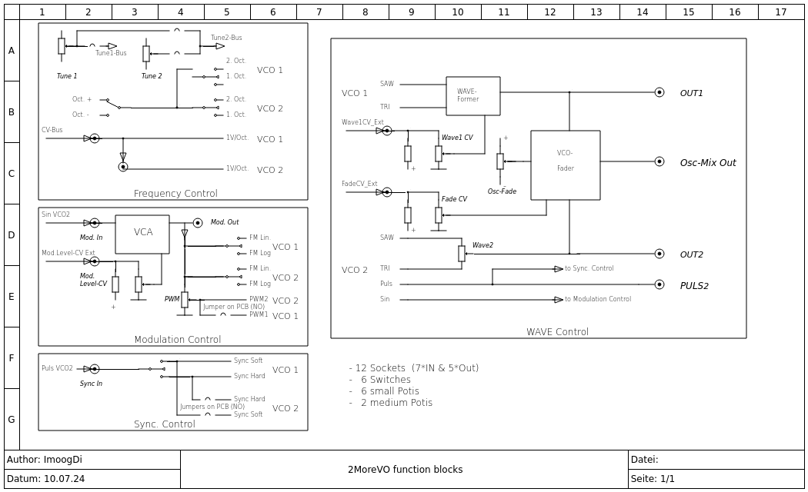

#  2MoreVO
 Eurorack Dual VCO using the public CEM3340/AS3340 chip.

**Table of Contents**

- [Introduction](#intro)
- [Construction Guide](./doc/constructionguide.md)
- [Calibration](./doc/calibration.md)
- [Technical data](#technical-data)
- [References](#references)
- [License](#license)

## Introduction

This eurorack-modul is designed for modular-synthesizers as dual Voltage Controlled Oscillator.  
The oszillators are build around two IC's: <u>AS3340</u>, a clone of that wellknown CEM3340.  
Another benifit is the <u>three cannel VCA: AS3363</u> included to control the modulation-level, waveform output of VCO1 and oscillator-signal fading between VCO1- and VCO2-outputs.  

The '2MoreVO'-PCB's are:  
- one main backplane ('Backplane'), holding all switches, pots, jacks and voltage-references.  
- two VCO-PCB's stacked on the 'Backplane'.  
- one another backplane-PCB ('Backplane_B') hodling the 'three cannel VCA', operational-amp's and the eurorack-connection stacked on the 'Backplane'.   

All parts are common available and DIY-friendly designed, most parts are SMD on the VCO-PCB's.   
(Details see attached pictures)  

- Modul Frontpanel

 
- Modul Backpanel

 
- Modul function-blocks

 

There are twelve 3.5mm jacks available for patching audio- and CV-signals.  
 

<table>
<tr>
    <th>Jack-Name</th>
    <th>Function</th>
    <th>Comment</th>
    <th>Detail</th>
</tr>
<tr>
    <td>1V/Oct CV1</td>
    <td>CV-input for VCO1 pitch control</td>
    <td>fixed 1Volt/Octave scaling</td>
    <td>This input is normalised with the eurobus Control-Voltage and connected with the '1V/Oct CV2' input. Patch-cabel plugged in breaks the default connection to eurobus CV but the connection to '1V/Oct CV2' is still available.</td>
</tr>
<tr>
    <td>Fade CV</td>
    <td>CV-input for fading oscillator-signals</td>
    <td>The Fading between Osc1- and Osc2-signals on 'Osc-Mix Out' is controlled with this CV</td>
    <td>CV level adjustable between 0 ... max. with 'Fade CV'-pot. works together with 'Osc-Fade'-pot.
Bipolar signal input.</td>
</tr>
<tr>
    <td>Wave1 CV</td>
    <td>CV-input for VCO1 wave-control</td>
    <td>The waveform on 'Osc1 Out' is controlled with this CV</td>
    <td>CV Level adjustable between 0 ... max. with 'Wave1 CV'-pot.
Bipolar signal input.</td>
</tr>
<tr>
    <td>Mod.Level CV</td>
    <td>CV-input for modulation level control</td>
    <td>Control of modulation level on 'Mod Out'</td>
    <td>Modulation Level adjustable between 0 ... max. with 'Mod.Level CV'-pot.
Bipolar signal input.</td>
</tr>
<tr>
    <td>Mod. In</td>
    <td>Modulation signal input</td>
    <td>input for external signals controlling FM(Lin/Log) and PWM on Osc1 and Osc2</td>
    <td>This input is normalised with the sinusoidal-signal from Osc2 if no signal is plugged in.
Bipolar signal input.</td>
</tr>
<tr>
    <td>1V/Oct CV2</td>
    <td>CV-input for VCO2 pitch control</td>
    <td>fixed 1Volt/Octave scaling</td>
    <td>This input is normalised with the '1V/Oct CV1' input. Patch-cabel plugged in breaks the default connection to '1V/Oct CV1'.</td>
</tr>
<tr>
    <td>Osc1 Out</td>
    <td>output for VCO1-oscillator signal</td>
    <td>triangle- to saw-waveform output, morvable manually or with external CV</td>
    <td>Waveform morvable with 'Wave1 CV'-pot and CV-signal.</td>
</tr>
<tr>
    <td>Osc-Mix Out</td>
    <td>output for mixed VCO1-/VCO2-oscillator signal</td>
    <td>mixed signal from Osc1- and Osc2-outputs</td>
    <td>Waveforms fadeable between Osc1- and Osc2-signal outputs. Fading can be done with 'Fade CV'-pot and CV-signal. 50%/50% Osc1/2-signal level on 'Osc-Mix Out', if 'Osc-Fade'-pot is in centerposition and no 'Fade CV' is plugged in.</td>
</tr>
<tr>
    <td>Osc2 Out</td>
    <td>output for VCO2-oscillator signal</td>
    <td>saw- to triangle-waveform output, morvable manually</td>
    <td>Waveform morvable with 'Wave2'-pot between saw- and triangle-signal.</td>
</tr>
<tr>
    <td>Sync In</td>
    <td>Sync-signal for VCO1 (optional VCO2)</td>
    <td>this signal can be switched to: 'Sync Hard', ' Sync Soft' or 'Off'</td>
    <td>This input is normalised with the 'Puls2 Out'-signal from VCO2. Patch-cabel plugged in breaks the default connection to 'Puls2 Out'.</td>
</tr>
<tr>
    <td>Mod Out</td>
    <td>output for modulation-signal controllable with 'Mod.Level CV'</td>
    <td>modulation-signal used for 'FMx Lin/Log' and 'PWM' default sinusoidal-signal from VCO2 used for VCO1 modulation</td>
    <td>sinusoidal-signal from VCO2 is available on this output if high impedance connection is used.
optional an external low impedance signal plugged in can overwride the internal modulation.</td>
</tr>
<tr>
    <td>Puls2 Out</td>
    <td>output for puls-signal from VCO2</td>
    <td>output-signal for synchronisation and audio the pulswith is controllable with 'PWM'-pot using the 'Mod Out'-signal</td>
    <td>This output is also internally linked to 'Sync In'.
Bipolar output with +-5.0Volt level.</td>
</tr>
</table>
 

There are eight potentiometers with following functions:  

<table>
<tr>
    <th>Pot-Name</th>
    <th>Function</th>
    <th>Comment</th>
    <th>Detail</th>
</tr>
<tr>
    <td>Tune 1</td>
    <td>Pitch for VCO1</td>
    <td>default pitch in center-position</td>
    <td>tuning-range +-2 octaves.</td>
</tr>
<tr>
    <td>Tune 2</td>
    <td>Pitch for VCO2</td>
    <td>default pitch in center-position</td>
    <td>tuning-range +-2 octaves.</td>
</tr>
<tr>
    <td>Osc-Fade</td>
    <td>manually fading between Osc1- and Osc2-signals on 'Osc-Mix Out'</td>
    <td>works as CV offset for the 'Fade CV'-signal</td>
    <td>pot to CCW: Osc2-signal output. pot to CW: Osc1-signal output. pot to centerposition: equal level output.</td>
</tr>
<tr>
    <td>Fade CV</td>
    <td>CV Level amount pot for fading between Osc1- and Osc2-signals on 'Osc-Mix Out'</td>
    <td>works together with 'Osc-Fade' for fading Osc1/2-signals</td>
    <td>CV Level adjustable between 0 ... max.</td>
</tr>
<tr>
    <td>Wave1 CV</td>
    <td>CV Level amount pot for Osc1 waveform-selection on 'Osc1 out'</td>
    <td>manually selection of waveform is possible if no CV-signal is plugged in</td>
    <td>CV Level adjustable between 0 ... max.</td>
</tr>
<tr>
    <td>Mod.Level CV</td>
    <td>CV Level amount pot for modulation control</td>
    <td>manually modulationlevel control is possible if no CV-signal is plugged in</td>
    <td>CV Level adjustable between 0 ... max.</td>
</tr>
<tr>
    <td>PWM</td>
    <td>pulswith pot to control amount of PWM</td>
    <td>the modulation-signal on 'Mod Out' is used for PWM</td>
    <td>PWM amount adjustable between 0 ... max. Pulswith is 50% on 'Puls2 Out' if pot is in CCW-position (set to 0).</td>
</tr>
<tr>
    <td>Wave2</td>
    <td>waveform selection pot for Osc2-signal</td>
    <td>manually morving between saw- and triangle-signal</td>
    <td>pot to CCW: SAW-signal. pot to CW: Triangle-signal. pot to centerposition: mixed signal.</td>
</tr>
</table>
 

There are six switches to control the behaviour of signals.  

<table>
<tr>
    <th>Switch</th>
    <th>Function</th>
    <th>Comment</th>
    <th>Detail</th>
</tr>
<tr>
    <td>FM1-switch</td>
    <td>switch for VCO1 FM modulation using signal on 'Mod Out'</td>
    <td>FM controll for VCO1</td>
    <td>FM1 Lin := Linear FM modulation. Off := function off. FM1 Log := Logarithmic FM modulation.</td>
</tr>
<tr>
    <td>Sync-switch</td>
    <td>switch for VCO1 Hard- or Soft-synchronisation with puls-signal from VCO2</td>
    <td>switched synchronisation-signal from 'Puls2 Out'</td>
    <td>Sync Hard := hard synced to VCO2. Off := sync. function off. Sync Soft := soft synced to VCO2.</td>
</tr>
<tr>
    <td>VCO1 Octave-switch</td>
    <td>switch for VCO1 pitch setting</td>
    <td>octaves up or down depending on 'Octave switch + or -'</td>
    <td>1 := one octave (up/down). 2 := two octaves (up/down).</td>
</tr>
<tr>
    <td>Octave up/down switch</td>
    <td>switch for VCO1- and VCO2-switched pitchcontrol</td>
    <td>selecting pitch up or down for VCO1 and VCO2</td>
    <td>+ :=  pitch up. - := pitch down.</td>
</tr>
<tr>
    <td>VCO2 Octave-switch</td>
    <td>switch for VCO2 pitch setting</td>
    <td>octaves up or down depending on 'Octave switch + or -'</td>
    <td>1 := one octave (up/down). 2 := two octaves (up/down).</td>
</tr>
<tr>
    <td>FM2-switch</td>
    <td>switch for VCO2 FM modulation using signal on 'Mod Out'</td>
    <td>FM controll for VCO2</td>
    <td>FM1 Lin := Linear FM modulation. Off := function off. FM1 Log := Logarithmic FM modulation.</td>
</tr>
</table>
 

## Technical data

- size:  
  width: 16HP  
  depth: 45mm

- power:  
    5Volt, 0 mA  
  +12Volt, 60mA  
  -12Volt, 60mA  

- frequency range: 20Hz to 20kHz.
- frequency CV scale: 1V/Oct on '1V/Oct CV1'- and '1V/Oct CV2'-inputs.
- frequency pot tuning range: +-2 Octaves.
- frequency switchable pitch range: plus or minus 1 or 2 octaves for oscillator 1/2.
- signal inputs, DC-coupled signal path.
- signal outputs, DC-coupled signal path.
- signal input impedance: > 50kOhm.
- signal output impedance: 500 Ohm.
- expandable with more '2MoreVO' dual-oscillator('s) used in master-/slave-configuration.

## References

* [electric druid, Single VCA crossfader](https://electricdruid.net/single-vca-crossfader/)
* [Tuning the AS3340](https://www.alfarzpp.lv/eng/sc/Tuning%20the%20AS3340.pdf)

## License
> Hardware:cc by-nc-sa 4.0  ([details](https://creativecommons.org/licenses/by-nc-sa/4.0/))

