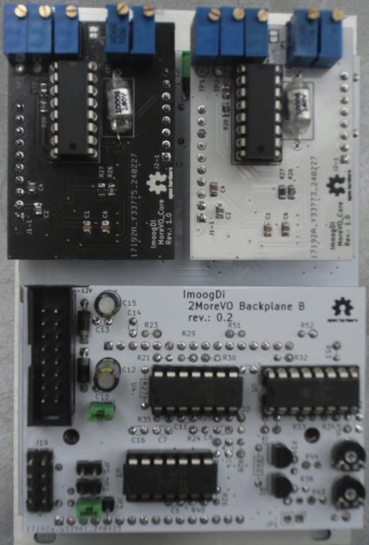

#  2MoreVO
 Calibration of CEM/AS3340 dual analog VCO eurorack-modul.

## Preconditions
 Required or recommended tools are:

- High precision voltage meter.
- Frequency meter.
- MoreVO_Core breadboard with 5.0V and 8.0V voltage references (if available).
- Eurorack for power (+12V/-12V) and keyboard-CV.
- 16pin Eurorack cable for modul-connection to the rack-bus.
- patchcables for modular synthesizers.
- all PCB's have to be mounted.

## Calibration

**Table of Contents**

- [Reference-voltage-Adjustment](#refvoltage_adjustment)
- [MoreVO_Core-Adjustments](#morevo_core_adjustments)
- [VCO2 sinusodial output-Adjustments](#sinusodial_adjustment)
- [Final check](#final_check)
- [License](#license)

 

### Reference-voltage-Adjustment on '2MoreVO Backplane
Reference-voltage-adjustment is done with precision trimmers 'RV1' and 'RV12' on the 'Backplane'.  

> Backplane top side precision trimmer **RV1** and **RV12**  
  

Measurement-points are **+2V** and **-2V** on 'Backplane B'.

> Backplane B measurment-points  
  
 
<table>
<tr>
    <th>measuring point</th>
    <th>adjustment on</th>
    <th>measured voltage</th>
    <th>remark</th>
</tr>
<tr>
    <td>'Backplane B' +2V (back side)</td>
    <td>'Backplane' RV1 (top side)</td>
    <td>+2000 mVolt</td>
    <td>adjust as close as possible to nominal value.</td>
</tr>
<tr>
    <td>'Backplane B' -2V (back side)</td>
    <td>'Backplane' RV12 (top side)</td>
    <td>-2000 mVolt</td>
    <td>adjust as close as possible to nominal value.</td>
</tr>
</table>

 

### 'MoreVO-Core'-Adjustment for true 1V/octave-range

For AS3340 calibration details see also URL: [AS3340 tuning](https://www.alfarzpp.lv/eng/sc/Tuning%20the%20AS3340.pdf)

If the MoreVO_Core breadboard (with 5.0V and 8.0V voltage references) is available, all required adjustments on 'MoreVO_Core's are done on that breadboard, else the '2MoreVO'-moduls must be stacked in the 'Backplane' and calibrated in the eurorack.

> MoreVO_Core precision pot's **RV1 ... RV5** location  
  

#### 'MoreVO_Core' adjustment on breadboard  

Preparation:

- Connect GND to header J1-1.  
- Connect +12Volt to header J1-2.  
- Connect -12Volt to Header J1-3.  

>Be carefull and check that connections.  
>Switch on powersupply and **warm up** that board at least for 30minutes.

<table>
<tr>
    <th>Step  Nr</th>
    <th>preparation</th>
    <th>action</th>
    <th>remark</th>
</tr>
<tr>
    <td>1</td>
    <td>Connect mV meter between TP1 and TP2</td>
    <td>Trim 'TEMPCO ADJ' pot (RV1) until: Voltage is 0.0mV</td>
    <td></td>
</tr>
<tr>
    <td>2</td>
    <td>Close (short) jumper JP1 on top-side of the board</td>
    <td>Trim 'REF PITCH C6' pot (RV2) until: Pitch is 1046.5 Hertz (C6)</td>
    <td>measured on SAW_Out (J2-2)</td>
</tr>
<tr>
    <td>3</td>
    <td>Apply +5.000Volt DC on 'Tune'-input (J1-4)</td>
    <td>Trim 'REFIND C6' pot (RV3) until: Pitch is again 1046.5 Hertz (C6)</td>
    <td>measured on SAW_Out (J2-2)</td>
</tr>
<tr>
    <td>4</td>
    <td>Apply 0.000Volt DC on 'Tune'-input (J1-4)</td>
    <td>Trim 'SCALE ADJ' pot (RV4) until: Pitch is 32.7 Hertz</td>
    <td>measured on SAW_Out (J2-2)</td>
</tr>
<tr>
    <td>5</td>
    <td>Apply +8.000V DC on 'Tune'-input (J1-4)</td>
    <td>Trim 'HIGH FREQUENCY ADJUST' pot (RV5) until: Pitch is 8372.0 Hertz</td>
    <td>measured on SAW_Out (J2-2)</td>
</tr>
</table>

Repead above steps for the second 'MoreVO_Core'.

After calibration put both 'MoreVO_Core' boards into the '2MoreVO' backplane.

#### 'MoreVO_Core' adjustment stacked on 2MoreVO backplane  

Preparation:

- Set 'Tune 1'and 'Tune 2' pot's to center-position.
- Set all <u>three-position switches</u> to center-position: **Off**.
- Set 'Wave1 CV' pot to: **CCW** (Saw).
- Set 'Wave2' pot to: **CCW** (Saw).
- Connect the '2MoreVO'-modul with 16pin Eurorack cable to the rack-bus.
- Connect patch-cabel into jack '1V/Oct CV1' on 2MoreVO-modul to get that 1V/octave CV voltage from keyboard.
- Switch on Eurorack power.
- Check voltages at pin J1-4 on both MoreVO_Core's to be zero. If required adjust that related tune-pots 'Tune 1' and 'Tune 2' to get at close as possible to zero volt on pins J1-4.

>**warm up** that '2MoreVO'-modul at least for 30minutes.

> '2MoreVO' mounted MoreVO_Core's  
  

Start calibration with one 'MoreVO_Core' and repeat it with the second one in following steps:

<table>
<tr>
    <th>Step  Nr</th>
    <th>preparation</th>
    <th>action</th>
    <th>remark</th>
</tr>
<tr>
    <td>1</td>
    <td>Connect mV meter between TP1 and TP2</td>
    <td>Trim 'TEMPCO ADJ' pot (RV1) until: Voltage is 0.0mV</td>
    <td>measured and adjusted at: VCO1 and VCO2.</td>
</tr>
<tr>
    <td>2</td>
    <td>Close (short) jumper JP1 on top-side of the board</td>
    <td>Trim 'REF PITCH C6' pot (RV2) until: Pitch is 1046.5 Hertz (C6)</td>
    <td>measured at: 'Osc1 Out' for VCO1. 'Osc2 Out' for VCO2.</td>
</tr>
<tr>
    <td>3</td>
    <td>Apply +5.000Volt CV on '1V/Oct CV1'-input pressing pitch-key 'C6' on the keyboard</td>
    <td>Trim 'REFIND C6' pot (RV3) until: Pitch is again 1046.5 Hertz (C6)</td>
    <td>measured at: 'Osc1 Out' for VCO1. 'Osc2 Out' for VCO2.</td>
</tr>
<tr>
    <td>4</td>
    <td>Apply 0.000Volt CV on '1V/Oct CV1'-input with disconnected keyboard CV-voltage. patch-cabel plugged out at keyboard side.</td>
    <td>Trim 'SCALE ADJ' pot (RV4) until: Pitch is 32.7 Hertz</td>
    <td>measured at: 'Osc1 Out' for VCO1. 'Osc2 Out' for VCO2.</td>
</tr>
<tr>
    <td>5</td>
    <td>Plugin keyboard patch-cabel again. Apply +8.000V DC on '1V/Oct CV1'-input pressing pitch-key 'C9' on the keyboard.</td>
    <td>Trim 'HIGH FREQUENCY ADJUST' pot (RV5) until: Pitch is 8372.0 Hertz</td>
    <td>measured at: 'Osc1 Out' for VCO1. 'Osc2 Out' for VCO2.</td>
</tr>
</table>

Repead above steps for the second 'MoreVO_Core'.

**1V/Octave calibration done**.

 

### VCO2 sinusodial-Adjustment

Preparation:

- patch-cabel plugged into jack 'Mod Out' and to any audio-input or waveform-display device.
- pot 'ModLevel CV' set to position: **CW**.
- switch on eurorack-power.

The waveform is adjusted with pot's RV9 (level) and RV11 (offset) on 'Backplane B'.

<table>
<tr>
    <th>Step  Nr</th>
    <th>action</th>
    <th>remark</th>
</tr>
<tr>
    <td>1</td>
    <td>Adjust signal-offset with offset-pot: 'RV11'</td>
    <td></td>
</tr>
<tr>
    <td>2</td>
    <td>Adjust sinusodial-waveform with level-pot: 'RV9'</td>
    <td></td>
</tr>
<tr>
    <td></td>
    <td></td>
    <td>repead steps:1 and 2 to get the best result</td>
</tr>
</table>

At least the output signal should look like the following waveform:
> VCO2 sinusodial output on 'Mod Out'  

 

### Final check

Preconditions:

- Jumper J4 on 'Backplane B' must be closed to getting the 1V/Octave CV-voltage from euro-bus.
- Set all <u>three-position switches</u> to center-position: **Off**.
- Modul '2MoreVO' placed into eurorack connected to the bus.
- Eurorack power switched on and warmed up at least for 30 minutes.

<table>
<tr>
    <th>Step  Nr</th>
    <th>action</th>
    <th>result</th>
    <th>remark</th>
</tr>
<tr>
    <td>1</td>
    <td>Set pot's 'Tune 1/2' to full CCW position</td>
    <td>measure current pitches on 'Osc1 Out' and 'Osc2 Out'</td>
    <td>remember currently measured pitch-values.</td>
</tr>
<tr>
    <td>2</td>
    <td>Set pot's 'Tune 1/2' to full CW position</td>
    <td>measure current pitches on 'Osc1 Out' and 'Osc2 Out'</td>
    <td>the pitches should be 4 octaves above the values measured in Step:1.</td>
</tr>
<tr>
    <td>3</td>
    <td>Set pot's 'Tune 1/2' to center position</td>
    <td>measure current pitches on 'Osc1 Out' and 'Osc2 Out'</td>
    <td>the pitches should be approximately 2 octaves above the values measured in Step:1.</td>
</tr>
<tr>
    <td>4</td>
    <td>Set switch 'Octave' to '+' and  switches 'VCO1'-Octave-'VCO2' to '1'</td>
    <td>measured pitches must be one octave above the 'Off' position</td>
    <td>measured or audible on 'Osc1 Out' and 'Osc2 Out'.</td>
</tr>
<tr>
    <td>5</td>
    <td>Set switch 'Octave' to '+' and  switches 'VCO1'-Octave-'VCO2' to '2'</td>
    <td>measured pitches must be two octaves above the 'Off' position</td>
    <td>measured or audible on 'Osc1 Out' and 'Osc2 Out'.</td>
</tr>
<tr>
    <td>6</td>
    <td>Set switch 'Octave' to '-' and  switches 'VCO1'-Octave-'VCO2' to '1'</td>
    <td>measured pitches must be one octave below the 'Off' position</td>
    <td>measured or audible on 'Osc1 Out' and 'Osc2 Out'.</td>
</tr>
<tr>
    <td>7</td>
    <td>Set switch 'Octave' to '-' and  switches 'VCO1'-Octave-'VCO2' to '2'</td>
    <td>measured pitches must be two octaves below the 'Off' position</td>
    <td>measured or audible on 'Osc1 Out' and 'Osc2 Out'.</td>
</tr>
<tr>
    <td>8</td>
    <td>Set all switches to 'Off' and  the VCO's to be in tune with pot's 'Tune 1/2'. Play octave-steps on the keyboard.</td>
    <td>check the VCO-pitches to be in tune over the octaves.</td>
    <td>measured or audible on 'Osc1 Out' and 'Osc2 Out'.</td>
</tr>
<tr>
    <td>9</td>
    <td>Tune pot 'Osc-Fade' from CCW to CW and backwards</td>
    <td>Fading between Osc1- and Osc2-Output waveform must be possible</td>
    <td>measured or audible on 'Osc-Mix Out'.</td>
</tr>
<tr>
    <td>10</td>
    <td>Tune pot 'Wave1 CV' from CCW to CW and backwards</td>
    <td>Changing between triangle- and saw-waveform must be possible</td>
    <td>measured or audible on 'Osc1 Out'.</td>
</tr>
<tr>
    <td>11</td>
    <td>Tune pot 'Wave2' from CCW to CW and backwards</td>
    <td>Changing between triangle- and saw-waveform must be possible</td>
    <td>measured or audible on 'Osc2 Out'.</td>
</tr>
<tr>
    <td>12</td>
    <td>Tune pot 'Mod.Level CV' from CCW to CW and backwards</td>
    <td>Sinusodial signal-level must change on 'Mod Out'</td>
    <td>measured or audible on 'Mod Out'.</td>
</tr>
<tr>
    <td>13</td>
    <td>Set pot 'Mod.Level CV' to CW and tune pot 'PWM' to CW and backwards</td>
    <td>Pulswith must change on 'Puls2 Out'</td>
    <td>measured or audible on 'Puls2 Out'.</td>
</tr>
<tr>
    <td>14</td>
    <td>Set switch 'FM1 Lin/Log' to 'FM1 Lin' and detune VCO2 against VCO1</td>
    <td>Linear frequeny-modulation on 'Osc1 Out'</td>
    <td>measured or audible on 'Osc1 Out'.</td>
</tr>
<tr>
    <td>15</td>
    <td>Set switch 'FM1 Lin/Log' to 'FM1 Log' and detune VCO2 against VCO1</td>
    <td>Logarithmic frequeny-modulation on 'Osc1 Out'</td>
    <td>measured or audible on 'Osc1 Out'.</td>
</tr>
<tr>
    <td>16</td>
    <td>Set switch 'Sync Hard/Soft' to 'Sync Hard' and detune VCO2 against VCO1</td>
    <td>Hard synchronisation done between VCO2 and VCO1 forced by VCO2</td>
    <td>measured or audible on 'Osc1 Out'.</td>
</tr>
<tr>
    <td>17</td>
    <td>Set switch 'Sync Hard/Soft' to 'Sync Soft' and detune VCO2 against VCO1</td>
    <td>Soft synchronisation done between VCO2 and VCO1 forced by VCO2</td>
    <td>measured or audible on 'Osc1 Out'.</td>
</tr>
<tr>
    <td>18</td>
    <td>Set switch 'FM2 Lin/Log' to 'FM2 Lin' and change modulation-level with pot 'Mod.Level CV'</td>
    <td>Linear self frequeny-modulation on 'Osc2 Out' depending on modulation-level</td>
    <td>measured or audible on 'Osc2 Out'.</td>
</tr>
<tr>
    <td>19</td>
    <td>Set switch 'FM2 Lin/Log' to 'FM2 Log' and change modulation-level with pot 'Mod.Level CV'</td>
    <td>Logarithmic self frequeny-modulation on 'Osc2 Out' depending on modulation-level</td>
    <td>measured or audible on 'Osc2 Out'.</td>
</tr>
</table>

 

## License
> Hardware:cc by-nc-sa 4.0

